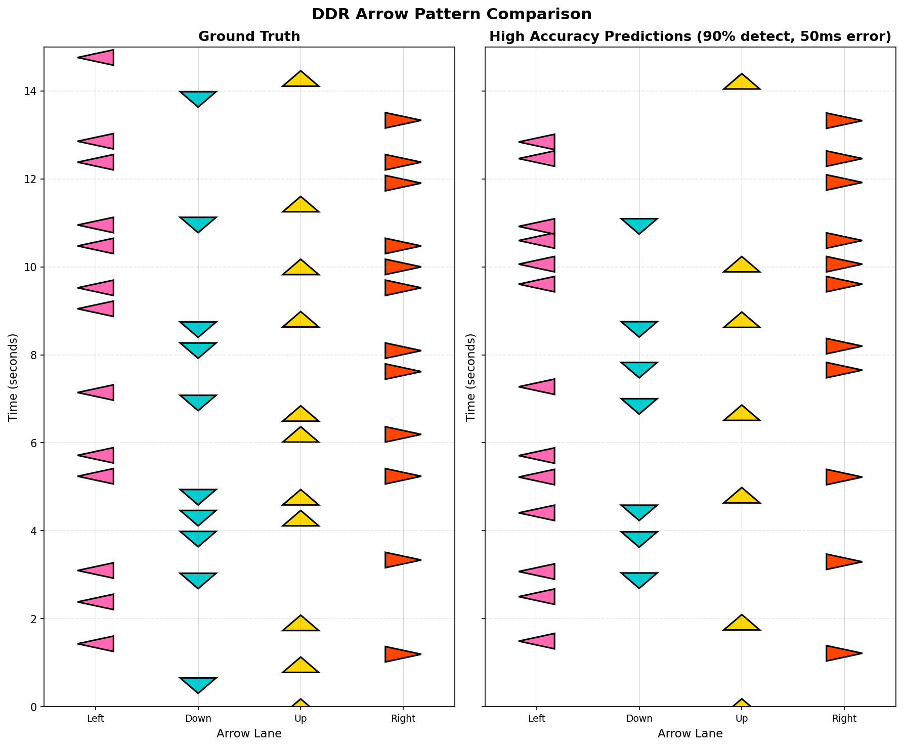
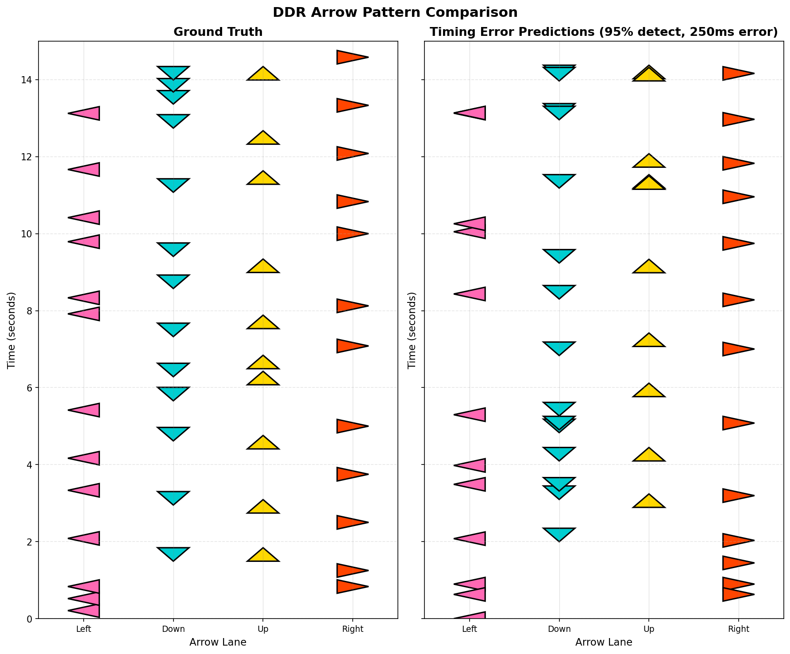
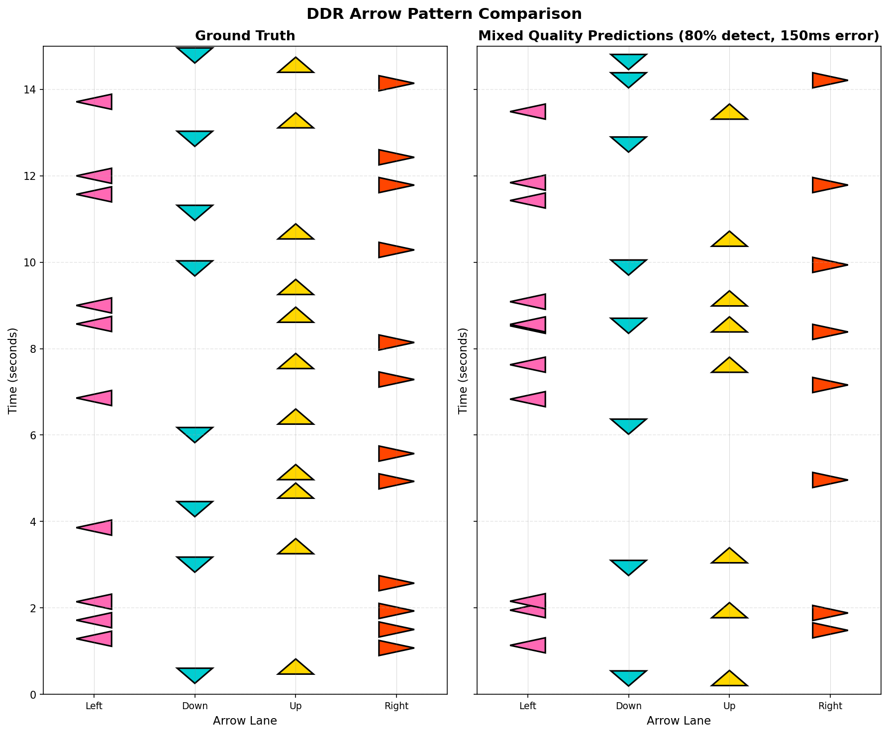
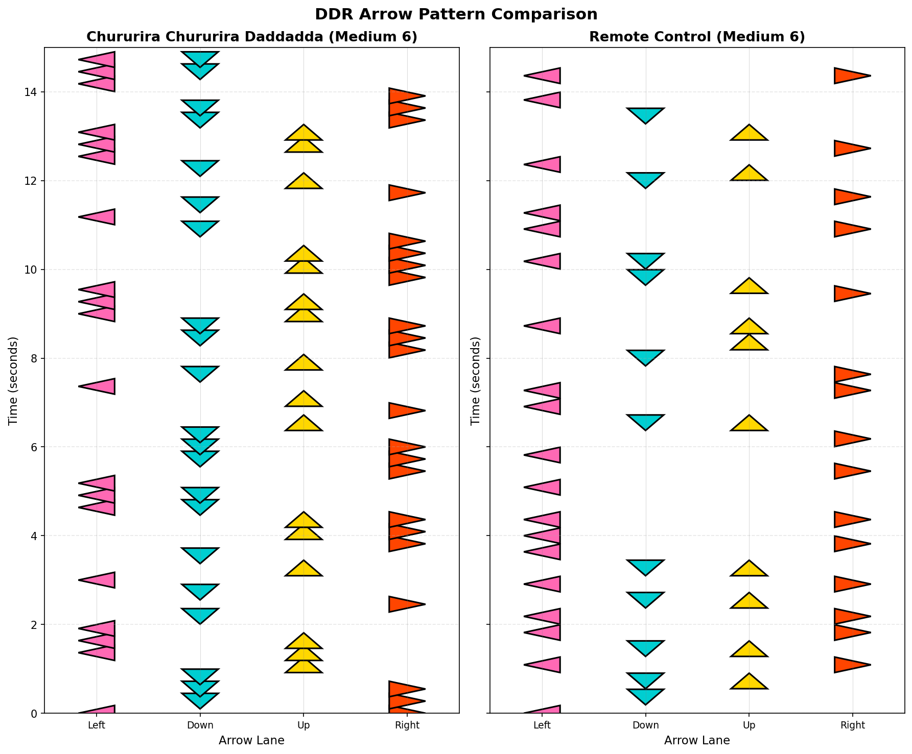
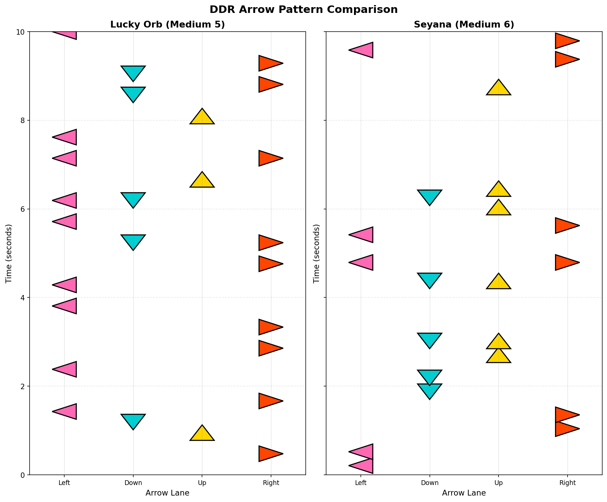

# Arrow Visualization Examples

This document showcases various examples of the arrow visualization tool demonstrating different prediction scenarios.

## Important Note

**All prediction examples shown here use SIMULATED predictions**, not real ML model outputs. They demonstrate:
- Realistic error patterns (timing errors, missed detections, false positives)
- Various prediction quality scenarios
- The visualization tool's ability to clearly show differences between ground truth and predictions

These simulations serve as templates for visualizing actual ML model predictions when a trained model is available.

## Example Gallery

### 1. High Accuracy Predictions
**File:** `artifacts/example_1_high_accuracy.png`

**Scenario:** 90% detection rate with 50ms timing error
- Simulates a well-trained model with excellent performance
- Most arrows are detected with minimal timing offset
- Shows what "good" predictions look like visually



### 2. Timing Errors
**File:** `artifacts/example_2_timing_errors.png`

**Scenario:** 95% detection rate but 250ms timing error
- Simulates a model that detects arrows well but struggles with timing
- Most arrows present but vertically shifted (timing offset visible)
- Useful for diagnosing timing-related issues in predictions



### 3. Poor Detection Rate
**File:** `artifacts/example_3_poor_detection.png`

**Scenario:** 65% detection rate with 80ms timing error
- Simulates a model with many missed detections
- When arrows are detected, timing is decent
- Shows what happens when model misses many events


### 4. Mixed Quality
**File:** `artifacts/example_4_mixed_quality.png`

**Scenario:** 80% detection rate with 150ms timing error
- Simulates medium overall performance
- Balanced mix of correct, missed, and offset predictions
- Represents typical "in-training" model performance



### 5. Song Comparison
**File:** `artifacts/example_5_song_comparison.png`

**Scenario:** Two different songs at same difficulty
- Not a prediction comparison - shows two original charts
- Demonstrates using the tool to compare songs
- Both columns show ground truth (no simulation)



### 6. Original Demo
**File:** `artifacts/arrow_comparison_demo.png`

**Scenario:** Lucky Orb vs Seyana (middle 10 seconds)
- Compares arrow patterns from two different songs
- Shows different arrow densities and patterns
- Pure ground truth comparison (no predictions)



### 7. ML Integration Example
**File:** `artifacts/ml_prediction_example.png`

**Scenario:** Simulated ML predictions with realistic errors
- 68% detection rate (15/22 arrows detected)
- Mix of timing errors and misses
- Template for visualizing actual ML results


### 8. Custom Pattern Test
**File:** `artifacts/test_custom_input.png`

**Scenario:** Hand-crafted patterns with intentional offsets
- Demonstrates custom input format
- Shows single arrows and double arrows (simultaneous presses)
- Useful for testing the visualization tool


## Generating More Examples

To generate additional visualization examples, run:

```bash
# Generate 5 new examples with different scenarios
python generate_more_examples.py
```

Or create your own using the simulation function:

```python
from visualize_arrows import extract_sm_window, visualize_arrows
from example_ml_integration import simulate_ml_predictions

# Extract ground truth
ground_truth = extract_sm_window('sm_files/Lucky Orb.sm', 5, 'medium', 
                                  start_time=60.0, duration=15.0)

# Simulate predictions with custom parameters
predictions = simulate_ml_predictions(
    ground_truth,
    timing_error_std=0.10,  # 100ms timing error
    miss_rate=0.15,         # 15% miss rate
    random_seed=123
)

# Visualize
visualize_arrows(ground_truth, predictions,
                 output_path='my_example.png',
                 title1='Ground Truth',
                 title2='My Custom Predictions')
```

## Interpreting Visualizations

### Vertical Position = Time
- Time flows from bottom (0s) to top (duration)
- Arrows at the same height occur simultaneously
- Vertical offset between left and right = timing error

### Missing Arrows
- Arrow present on left but not right = missed detection
- Arrow present on right but not left = false positive

### Color Coding
- **Pink**: Left arrow
- **Cyan**: Down arrow
- **Yellow**: Up arrow
- **Orange**: Right arrow

## Using with Real ML Predictions

When you have a trained model, replace the simulation with actual predictions:

```python
from visualize_arrows import extract_sm_window, visualize_arrows
import torch

# Load your trained model
model = torch.load('model.pth')
model.eval()

# Extract ground truth
ground_truth = extract_sm_window('sm_files/song.sm', 5, 'medium', 
                                  start_time=60.0, duration=15.0)

# Get actual predictions from your model
# (Your inference code here)
predictions = []
for t in sliding_windows:
    pred_arrows = model.predict(sensor_data[t])
    predictions.append({'time': t, 'arrows': pred_arrows})

# Visualize real predictions
visualize_arrows(ground_truth, predictions,
                 output_path='real_predictions.png',
                 title1='Ground Truth',
                 title2='Model Predictions')
```

## Notes

- All examples use songs from the `sm_files/` directory
- Time windows are extracted from middle sections of songs by default
- Random seeds ensure reproducible simulation results
- Simulation parameters can be adjusted to match expected model performance
